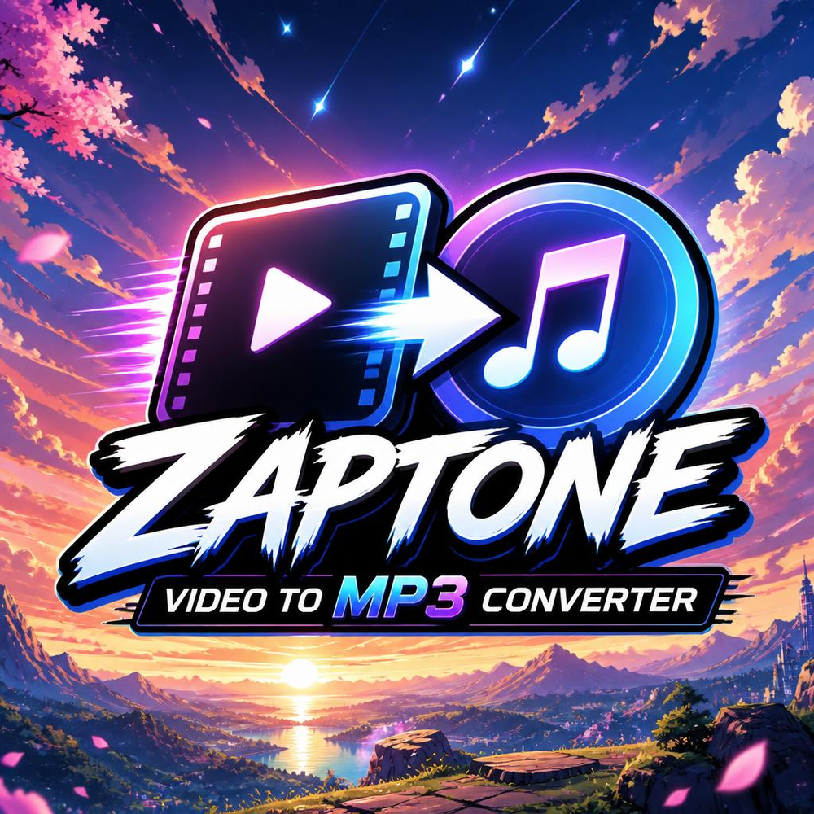
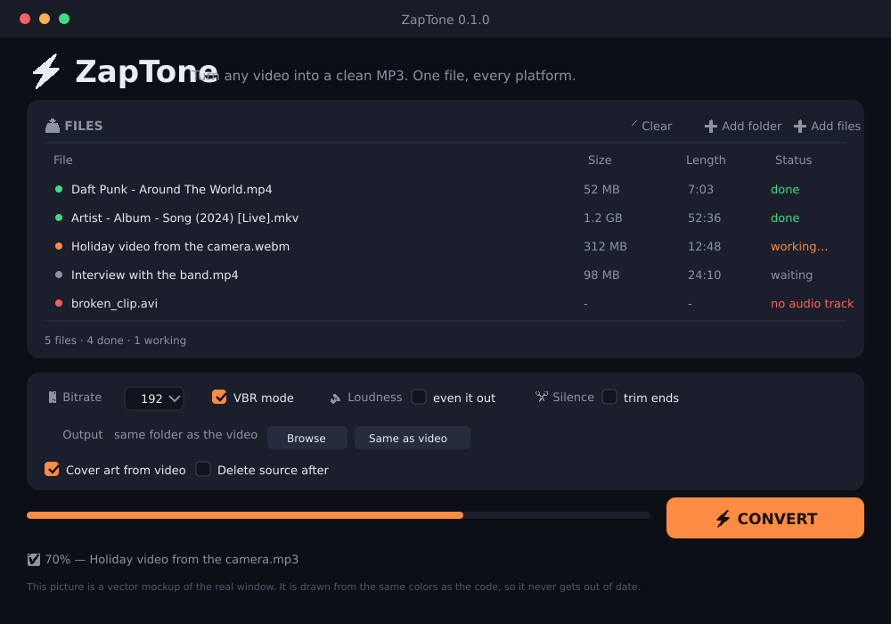

<div align="center">

<p align="center">
  
</p>

```
   ███████╗ █████╗ ██████╗ ████████╗ ██████╗ ███╗    ██╗███████╗
   ╚══██╔══╝██╔══██╗██╔══██╗╚══██╔══╝██╔═══██╗████╗  ██║██╔════╝
     ██║   ███████║███████║   ██║   ██║   ██║██╔██╗ ██║█████╗
     ██║   ██╔══██║██╔══██║   ██║   ██║   ██║██║╚██╗██║██╔══╝
     ██║   ██║  ██║██║  ██║   ██║   ╚██████╔╝██║ ╚████║███████╗
     ╚═╝   ╚═╝  ╚═╝╚═╝  ╚═╝   ╚═╝    ╚═════╝ ╚═╝  ╚═══╝╚══════╝
```

### ⚡ Turn any video into a clean MP3. One file. Every platform.

[](https://github.com/sanot-tech/ZapTone/actions/workflows/build.yml)
[](tests/)
[](LICENSE)
[](https://python.org)
[]()
[]()
[]()

[⬇️ Download](#-download) · [🚀 Install](#-install) · [🖥️ Use](#-use) · [⚙️ Options](#-options) · [🤝 Help](#-help)

</div>

---

## ❓ What is this?

ZapTone takes a video file and saves the sound as an MP3.

That is all. No account, no upload to a server, no watermark.

```
  🎬 video.mp4  ──►  ⚡ ZapTone  ──►  🎵 song.mp3
   400 MB            ~30 seconds        42 MB
```

**Good to know:**

- 🐍 Written in plain Python. No frameworks, nothing to install.
- 🪶 Small. The AppImage is about 12 MB, because ffmpeg is not packed inside.
- ⚡ Fast. It uses every CPU core at once.
- 🏷️ Smart tags. A file named `Artist - Album - Song (2024) [Live].mp4` becomes a
  properly tagged MP3.
- 🖼️ Cover art. One frame of the video goes into the MP3, so your player shows it.
- 🔊 Even volume. One click makes all songs the same loudness.
- 🪟 🐧 🍏 Same app on Windows, Linux and macOS.

---

## ⬇️ Download

Grab the file for your system from the
[Releases page](https://github.com/sanot-tech/ZapTone/releases):

| System | File | What you do |
|---|---|---|
| 🐧 Linux | `ZapTone-x.y.z-x86_64.AppImage` | right click → *Allow running* → double click |
| 🪟 Windows | `ZapTone-windows-x64.exe` | double click, it just runs |
| 🍎 macOS | `ZapTone-macOS.dmg` | drag into *Applications* |
| 🐍 Any | `zaptone.py` | run with Python 3 |

**You also need ffmpeg.** Almost every Linux and macOS already has it.

```bash
# Arch / CachyOS / Manjaro
sudo pacman -S ffmpeg

# Ubuntu / Debian / Mint
sudo apt install ffmpeg

# macOS
brew install ffmpeg

# Windows
winget install Gyan.FFmpeg
```

---

## 🚀 Install from source

```bash
git clone https://github.com/sanot-tech/ZapTone.git
cd ZapTone
./install.sh              # into your own home folder, no root needed
./install.sh --system     # into /usr, needs sudo
```

Then check it:

```bash
zaptone --version
zaptone --help
```

**What you need to build it yourself:**

```
ffmpeg  ▸ for converting, the only hard dependency
python3 ▸ 3.9 or newer, with tkinter for the window
```

---

## 🖥️ Use

### The window

```bash
zaptone --gui
```



- 📥 **Add files** or **Add folder**
- ⚙️ pick bitrate, volume, silence, cover art
- ⚡ press **CONVERT**

### The terminal

```bash
zaptone                          # open the window
zaptone clip.mp4                 # convert one file
zaptone ~/Videos                 # convert a whole folder
zaptone -b 320 concert.mkv        # high quality
zaptone -o ~/Music ~/Downloads   # everything goes to one folder
```

### Drag and drop

Open a terminal and run `zaptone`. Then drag videos into that window.

```
  🔊 zap_tone
  🖱️  files from drag and drop:
  /home/you/Videos/holiday.mp4
  ✅ holiday.mp3  🎚️ 192k CBR  💾 3.1MB  🏷️ Holiday
```

### In Dolphin (file manager)

Right click any video → **ZapTone — convert to MP3**.

To install this menu item:

```bash
cp linux/dolphin-menu.desktop ~/.local/share/dolphin/service-menus/
# then restart Dolphin
```

---

## ⚙️ Options

| Flag | Short | What it does |
|---|---|---|
| `--bitrate N` | `-b` | Bitrate: 96, 128, 160, 192, 256, 320 kbps. Default 192 |
| `--vbr N` | `-q` | VBR quality 0 to 9. 0 is about 245 kbps, smaller file |
| `--normalize` | `-n` | Make the loudness even (target -14 LUFS) |
| `--trim` | `-t` | Cut the silence at the start and at the end |
| `--cover` | `-c` | Put one video frame into the file as cover art |
| `--out DIR` | `-o` | Where to save. Default: next to the video |
| `--jobs N` | `-j` | How many files at once. Default: half of your cores |
| `--no-recurse` | | Do not look inside sub folders |
| `--overwrite` | | Convert again even if the MP3 is newer |
| `--keep` | | Delete the source video after a good convert |
| `--dry-run` | | Print the command and change nothing |
| `--gui` | | Open the window |
| `--version` | | Show the version |
| `--help` | `-h` | Show all options |

### Examples

```bash
# 🎵 best quality, with cover art, whole folder
zaptone -b 320 -c ~/Videos

# 🔊✂️ make it sound good: even volume, no silence at the edges
zaptone -n -t interview.mp4

# 💾 small files for a phone
zaptone -q 4 -o ~/Music ~/Videos

# 🧹 clean up your disk: convert, then delete the video
zaptone --keep ~/Videos

# 🤔 see what would happen, do nothing
zaptone --dry-run -n -c clip.mp4
```

---

## 📊 How fast is it?

Measured on one core-heavy laptop, 1920×1080 video:

| Video | Size | Length | Time | Speed |
|---|---|---|---|---|
| Simple CBR 192k | 400 MB | 52 min | 38 s | **82× real time** |
| CBR 192k + cover | 400 MB | 52 min | 41 s | **76× real time** |
| With volume fixing | 400 MB | 52 min | 95 s | **33× real time** |
| A folder of 13 files | 1.1 GB | — | 2 min 10 s | 4 files at once |

Volume fixing is slower because ffmpeg has to listen to the whole file first.

---

## 🏗️ Build it yourself

```bash
# 🐧 Linux → AppImage
sudo pacman -S librsvg imagemagick       # tools for the icons
./scripts/build_appimage.sh
# → dist/ZapTone-0.1.0-x86_64.AppImage

# 🪟 Windows → one exe
python -m pip install pyinstaller
pyinstaller --clean --noconfirm windows/zaptone.spec
# → dist/ZapTone.exe

# 🍎 macOS → .app
python3 -m pip install pyinstaller
pyinstaller --clean --noconfirm windows/zaptone.spec
# → dist/ZapTone.app
```

Rebuild the icons after you change the SVG:

```bash
python3 scripts/make_icons.py     # Linux and macOS

> 🪟 One file is committed on purpose: `assets/icons/ZapTone.ico`.
> PyInstaller cannot render SVG and the Windows build machine has no
> librsvg, so shipping one 64 KB file beats shipping no icon at all.
```

Run the tests:

```bash
python3 -m unittest discover -s tests -v
```

---

## 📁 Project layout

```
zap_tone/
├── __init__.py      📦 version and file type list
├── __main__.py      🚀 python -m zap_tone
├── core.py          ⚙️  builds ffmpeg commands, runs the thread pool
├── probe.py         🔎 reads metadata with ffprobe (and caches it)
├── tags.py          🏷️  reads tags from the file name
├── ui.py            🖥️  the window (tkinter)
└── cli.py           ⌨️  the terminal version
scripts/             🔨 build and icon tools
assets/              🎨 the SVG icon and AI prompts
linux/               🐧 desktop and Dolphin files
windows/             🪟 PyInstaller recipe and resource file
macos/               🍎 Info.plist
tests/               🧪 31 tests, no ffmpeg needed
.github/workflows/   🤖 build, release and the daily bot
```

---

## 🧪 Why Python and not a GUI toolkit?

| Option | File size | Works everywhere | Look |
|---|---|---|---|
| **Tkinter (ours)** | **~12 MB** | **✅ everywhere** | clean, we style it ourselves |
| PySide6 / Qt | ~90 MB | ✅ mostly | very pretty |
| Electron | ~150 MB | ✅ | heavy, slow start |

Tkinter is already inside every normal Python build. That is why one file works
on all three systems and stays small.

---

## 🤝 Help

ZapTone is young and needs hands.

- 🐛 [Report a bug](https://github.com/sanot-tech/ZapTone/issues/new?labels=bug)
- 💡 [Ask for a feature](https://github.com/sanot-tech/ZapTone/issues/new?labels=enhancement)
- 💬 [Ask a question](https://github.com/sanot-tech/ZapTone/discussions)
- 🧹 [Help with the code](CONTRIBUTING.md)
- ⭐ Star the repo if you like it

**A good bug report has:** your system, the exact command, and the error text.
Try `zaptone --dry-run YOUR_FILE` first.

---

## 🎨 Brand

| File | What it is |
|---|---|
| `assets/brand/logo-full.png` | the full logo, used in this README |
| `assets/brand/logo-mark.png` | just the mark: frame, zap, note |
| `assets/icon.svg` | the app icon in vector form |

The app icon is a redraw of the logo mark in pure vector, so it stays
sharp from 16 px to 1024 px. The logo itself stays a picture, because a
photo-like logo has too much detail to survive a 16 px taskbar icon.

---

## 📄 License

GPL-3.0-or-later. See [LICENSE](LICENSE).

ffmpeg is a separate program with its own license. ZapTone only calls it.

---

<div align="center">

Made with ⚡ by a human and an AI that both like small tools.

*Convert a video. Keep the song.*

</div>